<p align="center">
  
</p>

<p align="center">
  <a href="https://fuzail-dev.vercel.app/"></a>
  <a href="https://www.linkedin.com/in/mohdfuzailansari"></a>
  <a href="https://x.com/fuzail_ansarii"></a>
</p>


## `▸ PLAYER STATS`

```text
PLAYER ........ Mohd Fuzail Ansari
CLASS ......... Full-Stack Developer
BASE .......... India (UTC +5:30)
MAIN WEAPON ... Next.js + TypeScript + PostgreSQL
SPECIAL ....... ships products end to end — database, backend, UI, auth, payments, deploy
SIDE QUEST .... building Clentric, a SaaS for freelancers
STATUS ........ ● open to full-time roles (remote / on-site)
```

## `▸ LEVELS CLEARED`

<table>
<tr>
<td width="50%" valign="top">

**`LV.1` [SU Mock Test](https://test.shippingupdates.in/)** &nbsp;`● LIVE`

Paid mock-test platform for maritime entrance exams. Timed MCQ tests, instant scoring, analytics and a public leaderboard. Real students have bought and completed tests.

`Next.js` `PostgreSQL` `Drizzle` `Clerk` `Razorpay`

[▸ play](https://test.shippingupdates.in/) · [▸ source](https://github.com/fuzailansariii/su-prep)

</td>
<td width="50%" valign="top">

**`LV.2` [Shipping Updates](https://shippingupdates.in/)** &nbsp;`● LIVE`

E-commerce and study platform for Merchant Navy aspirants. Physical books, instant PDF downloads, Razorpay payments and order management. Used by students across India.

`Next.js` `PostgreSQL` `Drizzle` `Clerk` `Razorpay`

[▸ play](https://shippingupdates.in/) · [▸ source](https://github.com/fuzailansariii/shipping-updates)

</td>
</tr>
<tr>
<td width="50%" valign="top">

**`LV.3` [Clentric](https://clentric.app/)** &nbsp;`◐ IN PROGRESS`

My own SaaS for freelancers — clients, projects, proposals and invoices in one place. Built with a `feature/* → dev → main` PR workflow.

`Next.js` `PostgreSQL` `Drizzle` `Supabase` `Clerk`

[▸ play](https://clentric.app/) · [▸ source](https://github.com/fuzailansariii/clentric)

</td>
<td width="50%" valign="top">

**`LV.4` [DropFile](https://dropfile-six.vercel.app/)** &nbsp;`● LIVE`

Private cloud file manager with drag-and-drop uploads, folders, starred files, and trash with restore.

`Next.js` `PostgreSQL` `Drizzle` `Clerk`

[▸ play](https://dropfile-six.vercel.app/) · [▸ source](https://github.com/fuzailansariii/dropfile)

</td>
</tr>
</table>

## `▸ INVENTORY`

```text
[ FRONTEND ]  Next.js · React · TypeScript · Tailwind CSS · shadcn/ui
[ BACKEND  ]  Node.js · Server actions · API routes · REST APIs
[ DATABASE ]  PostgreSQL · Drizzle ORM · Prisma · Supabase
[ AUTH/PAY ]  Clerk · NextAuth · Razorpay
[ TOOLING  ]  Git · GitHub Actions · Vercel · Docker (learning)
```

## `▸ NOW LOADING`

```text
[██████████░░░░░░]  Docker
[████████░░░░░░░░]  CI/CD pipelines
[██████░░░░░░░░░░]  Testing (Vitest / Playwright)
```


<p align="center">
  <a href="https://fuzail-dev.vercel.app/#contact">
    
  </a>
</p>
